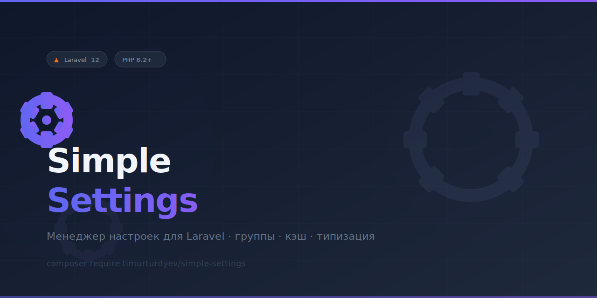

# Simple Settings для Laravel

<p align="center">
  
</p>

Лёгкий менеджер настроек для Laravel с поддержкой групп, кэшированием и автоматическим приведением типов.

[English](#english)

---

## Требования

- PHP 8.2+
- Laravel 12.x

## Установка

```bash
composer require timurturdyev/simple-settings
```

Опубликуйте конфиг и миграцию:

```bash
php artisan vendor:publish --provider="TimurTurdyev\SimpleSettings\Providers\SettingServiceProvider"
```

Запустите миграцию:

```bash
php artisan migrate
```

## Использование

### Через Facade

```php
use TimurTurdyev\SimpleSettings\Facades\Setting;

Setting::set('site_name', 'My App');

$name = Setting::get('site_name');              // 'My App'
$name = Setting::get('missing', 'default');    // 'default'

Setting::has('site_name'); // true
Setting::remove('site_name');
Setting::all();        // Collection всех настроек текущей группы
Setting::flushCache();
```

### Через сервис-контейнер

```php
use TimurTurdyev\SimpleSettings\Contracts\SettingStorageInterface;

$settings = app(SettingStorageInterface::class);
$settings->set('site_name', 'My App');
```

## Группы

Настройки разделены по группам. Группа по умолчанию — `global`.

```php
// forGroup() — возвращает новый изолированный экземпляр
$email = Setting::forGroup('email');
$email->set('host', 'smtp.example.com');
$email->get('host'); // 'smtp.example.com'

Setting::get('host'); // null — другая группа

// group() — изменяет текущий экземпляр
Setting::group('email')->get('host');
```

## Типы данных

Типы определяются и восстанавливаются автоматически:

```php
Setting::set('count',   42);          // integer
Setting::set('price',   9.99);        // float
Setting::set('enabled', true);        // boolean
Setting::set('tags',    ['a', 'b']);  // array (хранится как JSON)
Setting::set('key',     null);        // null
```

## Массовая запись

```php
Setting::set([
    'site_name' => 'My App',
    'site_url'  => 'https://example.com',
    'per_page'  => 15,
]);
```

Кэш сбрасывается один раз после записи всех значений.

## Обход кэша

```php
$value = Setting::get('key', null, fresh: true);
$all   = Setting::all(fresh: true);
```

## Artisan-команды

```bash
# Получить настройку
php artisan setting:get site_name
php artisan setting:get host --group=email
php artisan setting:get host --group=email --fresh

# Установить настройку (тип определяется автоматически)
php artisan setting:set site_name "My App"
php artisan setting:set enabled true
php artisan setting:set per_page 15
php artisan setting:set tags '["a","b"]'
php artisan setting:set host smtp.example.com --group=email

# Список настроек
php artisan setting:list
php artisan setting:list --group=email

# Очистить кэш
php artisan setting:clear
php artisan setting:clear --group=email

# Удалить настройку
php artisan setting:delete site_name
php artisan setting:delete host --group=email

# Удалить все настройки группы
php artisan setting:delete --group=email
```

## События

| Событие | Когда срабатывает |
|---------|------------------|
| `SettingRetrieved` | при вызове `get()` |
| `SettingSaved` | при записи через `set()` |
| `SettingDeleted` | при удалении конкретного ключа через `remove()` |

```php
use TimurTurdyev\SimpleSettings\Events\SettingSaved;
use Illuminate\Support\Facades\Event;

Event::listen(SettingSaved::class, function (SettingSaved $event) {
    // $event->key
    // $event->value
    // $event->group
});
```

## Валидация

Добавьте правила в `config/simple-settings.php`:

```php
'validation_rules' => [
    'email'    => 'email',
    'per_page' => 'integer|min:1|max:200',
    'enabled'  => 'boolean',
],
```

При нарушении правила `set()` выбрасывает `InvalidArgumentException`.

## Конфигурация

```php
// config/simple-settings.php
return [
    'table_name'       => 'simple_settings', // название таблицы
    'path_cache_key'   => 'simple_settings', // префикс ключей кэша
    'validation_rules' => [],                // правила валидации по ключу
];
```

## Схема БД

```
simple_settings
├── group       string
├── name        string
├── val         text
├── type        char(20)
├── created_at
└── updated_at

PRIMARY KEY (group, name)
```

## Справочник API

| Метод | Описание |
|-------|----------|
| `get(string $key, mixed $default = null, bool $fresh = false)` | Получить значение настройки |
| `set(string\|array $key, mixed $val = null)` | Установить одно или несколько значений |
| `has(string $key)` | Проверить существование ключа |
| `remove(?string $key = null)` | Удалить ключ или все ключи группы (если `null`) |
| `all(bool $fresh = false)` | Получить все настройки группы как Collection |
| `flushCache()` | Сбросить кэш текущей группы |
| `group(string $group)` | Переключить группу у текущего экземпляра |
| `forGroup(string $group)` | Вернуть новый экземпляр для указанной группы |

---

## English

Lightweight settings manager for Laravel with group namespacing, caching, and automatic type casting.

**Requirements:** PHP 8.2+, Laravel 12.x

**Install:**
```bash
composer require timurturdyev/simple-settings
php artisan vendor:publish --provider="TimurTurdyev\SimpleSettings\Providers\SettingServiceProvider"
php artisan migrate
```

**Basic usage:**
```php
use TimurTurdyev\SimpleSettings\Facades\Setting;

Setting::set('key', 'value');
Setting::get('key');                        // 'value'
Setting::get('missing', 'default');        // 'default'
Setting::set(['key1' => 1, 'key2' => 2]); // bulk
Setting::forGroup('email')->set('host', 'smtp.example.com');
Setting::all(fresh: true);                 // bypass cache
```

Types (`integer`, `float`, `boolean`, `array`, `null`) are detected and restored automatically.

For full documentation see the Russian section above.
