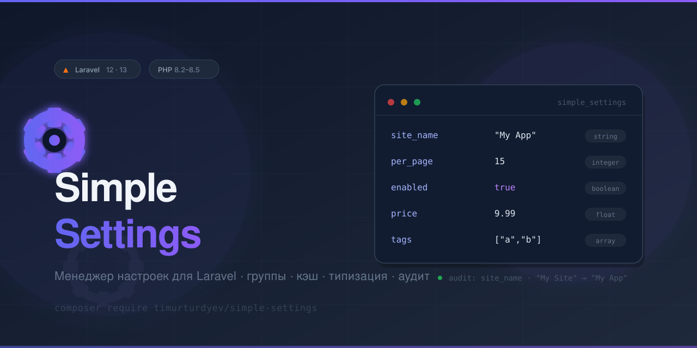

# Simple Settings для Laravel

<p align="center">
  
</p>

Лёгкий менеджер настроек для Laravel с поддержкой групп, кэшированием и автоматическим приведением типов.

[English](#english)

---

## Требования

- PHP 8.2, 8.3, 8.4 или 8.5
- Laravel 12.x или 13.x

## Установка

```bash
composer require timurturdyev/simple-settings
```

Опубликуйте конфиг и миграцию:

```bash
php artisan vendor:publish --provider="TimurTurdyev\SimpleSettings\Providers\SettingServiceProvider"
```

Запустите миграцию:

```bash
php artisan migrate
```

## Использование

### Через Facade

```php
use TimurTurdyev\SimpleSettings\Facades\Setting;

Setting::set('site_name', 'My App');

$name = Setting::get('site_name');              // 'My App'
$name = Setting::get('missing', 'default');    // 'default'

Setting::has('site_name'); // true
Setting::remove('site_name');   // удалить конкретный ключ
Setting::removeAll();           // удалить все настройки группы
Setting::all();        // Collection всех настроек текущей группы
Setting::flushCache();
```

### Через сервис-контейнер

```php
use TimurTurdyev\SimpleSettings\Contracts\SettingStorageInterface;

$settings = app(SettingStorageInterface::class);
$settings->set('site_name', 'My App');
```

## Группы

Настройки разделены по группам. Группа по умолчанию — `global`.

```php
// forGroup() — возвращает новый изолированный экземпляр
$email = Setting::forGroup('email');
$email->set('host', 'smtp.example.com');
$email->get('host'); // 'smtp.example.com'

Setting::get('host'); // null — другая группа

// group() — алиас для forGroup(), тоже возвращает новый экземпляр
Setting::group('email')->get('host');
```

## Типы данных

Типы определяются и восстанавливаются автоматически:

```php
Setting::set('count',   42);          // integer
Setting::set('price',   9.99);        // float
Setting::set('enabled', true);        // boolean
Setting::set('tags',    ['a', 'b']);  // array (хранится как JSON)
Setting::set('key',     null);        // null
```

## Массовая запись

```php
Setting::set([
    'site_name' => 'My App',
    'site_url'  => 'https://example.com',
    'per_page'  => 15,
]);
```

Вся пачка уходит в БД одним upsert-запросом. Валидация идёт до записи: невалиден хоть один ключ, не сохранится ни один. Кэш сбрасывается один раз после записи всех значений.

## Обход кэша

```php
$value = Setting::get('key', null, fresh: true);
$all   = Setting::all(fresh: true);
```

## Artisan-команды

```bash
# Получить настройку
php artisan setting:get site_name
php artisan setting:get host --group=email
php artisan setting:get host --group=email --fresh

# Установить настройку (тип определяется автоматически)
php artisan setting:set site_name "My App"
php artisan setting:set enabled true
php artisan setting:set per_page 15
php artisan setting:set tags '["a","b"]'
php artisan setting:set host smtp.example.com --group=email

# Список настроек
php artisan setting:list
php artisan setting:list --group=email

# Очистить кэш
php artisan setting:clear
php artisan setting:clear --group=email

# Удалить настройку
php artisan setting:delete site_name
php artisan setting:delete host --group=email

# Удалить все настройки группы (через removeAll)
php artisan setting:delete --group=email

# Экспорт всех настроек в JSON
php artisan setting:export backup.json
php artisan setting:export backup.json --group=email   # только одна группа
php artisan setting:export                              # вывод в stdout

# Импорт из JSON (по умолчанию merge — существующие ключи перезаписываются, новые добавляются)
php artisan setting:import backup.json
php artisan setting:import backup.json --group=email   # импортировать только одну группу
php artisan setting:import backup.json --replace       # сначала очистить группы из файла (с подтверждением)
```

## События

По умолчанию события **отключены**. Включить можно двумя способами:

**Через конфиг** (глобально для всего приложения):
```php
// config/simple-settings.php
'events' => true,
```

**Через метод** (точечно для конкретного вызова):
```php
Setting::withEvents()->set('key', 'value');
Setting::withEvents()->remove('key');

// Отключить явно, даже если в конфиге включено:
Setting::withoutEvents()->set('key', 'value');

// Работает в связке с группами:
Setting::forGroup('email')->withEvents()->set('host', 'smtp.example.com');
```

`withEvents()` и `withoutEvents()` возвращают новый экземпляр — текущий не изменяется.

| Событие | Когда срабатывает | Поля payload |
|---------|------------------|--------------|
| `SettingSaved` | при записи через `set()` | `key`, `value`, `group`, `oldValue`, `existed` |
| `SettingDeleted` | при удалении конкретного ключа через `remove()` | `key`, `group`, `oldValue` |
| `SettingsFlushed` | при `removeAll()` (очистка всей группы) | `group` |

При включённых событиях `oldValue` и `existed` заполнены всегда (значение берётся из кеша). Пустое удаление (нет ключа, пустая группа) событий не даёт.

```php
use TimurTurdyev\SimpleSettings\Events\SettingSaved;
use Illuminate\Support\Facades\Event;

Event::listen(SettingSaved::class, function (SettingSaved $event) {
    // $event->key, $event->value, $event->group
    // $event->oldValue, $event->existed
});
```

## Валидация

Добавьте правила в `config/simple-settings.php`:

```php
'validation_rules' => [
    'email'    => 'email',
    'per_page' => 'integer|min:1|max:200',
    'enabled'  => 'boolean',
],
```

При нарушении правила `set()` выбрасывает `InvalidArgumentException`.

## Активити-лог (опционально)

Опциональное логирование изменений настроек в отдельную таблицу `simple_setting_changes`. Без сторонних пакетов — своя модель + listener + миграция (которая накатывается автоматически при `php artisan migrate`).

**Включение:** хватает одного флага, события логу не нужны:

```php
// config/simple-settings.php
'audit' => [
    'enabled' => true,
    'table'   => 'simple_setting_changes', // имя таблицы можно переопределить
],
```

Библиотека читает текущее значение из кеша, кладёт его в `old_payload`, новое в `new_payload`. Causer берётся из `auth()->user()`, в CLI/queue будет `null`.

**Чтение истории:**

```php
use TimurTurdyev\SimpleSettings\Models\SimpleSettingChange;

// Вся история конкретного ключа
SimpleSettingChange::query()
    ->forSetting('email', 'host')
    ->latest('created_at')
    ->limit(20)
    ->get();

// Только удаления
SimpleSettingChange::query()->event('deleted')->get();

// Действия конкретного пользователя
SimpleSettingChange::query()
    ->where('causer_type', User::class)
    ->where('causer_id', $userId)
    ->get();
```

**Поля записи:** `group`, `name`, `event` (`created` / `updated` / `deleted`), `old_payload` (JSON или `null`), `new_payload`, `causer_type`, `causer_id`, `created_at`.

**Известные ограничения:**
- `removeAll()` НЕ создаёт записей в активити-логе (он бесшумный по умолчанию). Для аудита очистки группы — слушайте `SettingsFlushed` событие самостоятельно или удаляйте ключи через `remove($key)` явно.
- `withoutEvents()` глушит только события, лог продолжает писаться. Выключить его можно лишь через `audit.enabled`.

## Конфигурация

```php
// config/simple-settings.php
return [
    'table_name'        => 'simple_settings', // название основной таблицы
    'cache_key_prefix'  => 'simple_settings', // префикс ключей кэша
    'events'            => false,             // глобально включить события
    'validation_rules'  => [],                // правила валидации по ключу

    'audit' => [
        'enabled' => false,                       // активити-лог изменений настроек
        'table'   => 'simple_setting_changes',
    ],
];
```

## Лимиты значений

Колонка `val` создаётся как `TEXT` — на MySQL/MariaDB это **65 535 байт** (~64 KB), на PostgreSQL и SQLite ограничения нет. Для типовых настроек этого с большим запасом: список из 200 категорий-объектов влезет, массив из 10 000 коротких строк — тоже. Если упёрлись в лимит — это сигнал, что в одну настройку положили что-то «не то» (каталог товаров, лог, контент). Для таких данных нужна отдельная таблица или другое хранилище, не settings-таблица.

## Схема БД

```
simple_settings
├── group       string
├── name        string
├── val         text
├── type        string(20)
├── created_at
└── updated_at

PRIMARY KEY (group, name)
```

## Справочник API

| Метод | Описание |
|-------|----------|
| `get(string $key, mixed $default = null, bool $fresh = false)` | Получить значение настройки |
| `set(string\|array $key, mixed $val = null): void` | Установить одно или несколько значений |
| `has(string $key)` | Проверить существование ключа |
| `remove(string $key): int` | Удалить конкретный ключ |
| `removeAll(): int` | Удалить все настройки текущей группы |
| `all(bool $fresh = false)` | Получить все настройки группы как Collection |
| `list(?string $group = null)` | Получить все записи (raw) с фильтром по группе |
| `groups(): array` | Получить список всех групп |
| `flushCache()` | Сбросить кэш текущей группы |
| `group(string $group)` | Алиас для `forGroup()` — новый экземпляр |
| `forGroup(string $group)` | Вернуть новый экземпляр для указанной группы |
| `withEvents()` | Вернуть новый экземпляр с включёнными событиями |
| `withoutEvents()` | Вернуть новый экземпляр с отключёнными событиями |

## Преимущества

Простой key-value для настроек приложения. Не нужно описывать PHP-класс под каждую группу настроек и не нужна миграция на каждый новый ключ — всё хранится в одной таблице `simple_settings`, дубликаты исключены составным первичным ключом `(group, name)`. Тип значения (`string`, `int`, `float`, `bool`, `array`, `null`) сохраняется и восстанавливается автоматически. Из зависимостей — только `illuminate/database` и `illuminate/support`.

## Обновление до v6

- Событие `SettingRetrieved` удалено.
- Активити-логу хватает `audit.enabled`, флаг `events` ему не нужен. Он же единственный выключатель: `withoutEvents()` на лог не влияет.
- При включённых событиях `oldValue` и `existed` заполнены всегда, аудит тут ни при чём.
- Пустые удаления (нет ключа, пустая группа) не дают ни событий, ни строк в логе.
- `set([...])` пишет пачку одним запросом. Валидация идёт до записи: упала на одном ключе, не сохранился ни один (в v5 часть успевала записаться).

---

## English

Lightweight settings manager for Laravel with group namespacing, caching, and automatic type casting.

**Requirements:** PHP 8.2+, Laravel 12 or 13

**Install:**
```bash
composer require timurturdyev/simple-settings
php artisan vendor:publish --provider="TimurTurdyev\SimpleSettings\Providers\SettingServiceProvider"
php artisan migrate
```

**Basic usage:**
```php
use TimurTurdyev\SimpleSettings\Facades\Setting;

Setting::set('key', 'value');
Setting::get('key');                        // 'value'
Setting::get('missing', 'default');        // 'default'
Setting::set(['key1' => 1, 'key2' => 2]); // bulk
Setting::forGroup('email')->set('host', 'smtp.example.com');
Setting::all(fresh: true);                 // bypass cache
```

Types (`integer`, `float`, `boolean`, `array`, `null`) are detected and restored automatically.

**Configuration keys:** `table_name`, `cache_key_prefix`, `events`, `validation_rules`, `audit.enabled`, `audit.table`.

**Value size limits:** the `val` column is `TEXT` — 64 KB on MySQL/MariaDB, unlimited on PostgreSQL/SQLite. Typical settings fit with plenty of room (200 catalog-like objects, 10 000 short strings). Hitting the cap usually means the data belongs in its own table, not in settings.

### Activity log (optional)

Change history in a separate `simple_setting_changes` table. Enable `audit.enabled` in the config, events are not required. Every `set()` / `remove()` records old and new payload plus the causer. `withoutEvents()` does not affect the log.

```php
use TimurTurdyev\SimpleSettings\Models\SimpleSettingChange;

SimpleSettingChange::query()
    ->forSetting('email', 'host')
    ->latest('created_at')
    ->limit(20)
    ->get();
```

`removeAll()` is intentionally silent and dispatches `SettingsFlushed` instead of per-key entries; listen to it directly if you need to audit group resets.

### Artisan commands

`setting:get`, `setting:set`, `setting:list`, `setting:clear`, `setting:delete`, plus `setting:export {file?} {--group=}` and `setting:import {file} {--replace} {--group=}` for backups and environment-to-environment migration. Round-trip preserves PHP types because the JSON file carries the type column alongside the raw value.

### Events

`SettingSaved`, `SettingDeleted`, `SettingsFlushed`. Disabled by default; enable via the `events` config key or `Setting::withEvents()`. `SettingSaved` carries `oldValue` and `existed` whenever events are on. No-op deletes dispatch nothing.

### Highlights

Plain key-value storage for app settings. No PHP class per settings group, no migration per new key — everything lives in a single `simple_settings` table, and the composite primary key `(group, name)` rules out duplicates. Value types (`string`, `int`, `float`, `bool`, `array`, `null`) are stored and restored automatically. The only dependencies are `illuminate/database` and `illuminate/support`.

For full documentation see the Russian section above.
